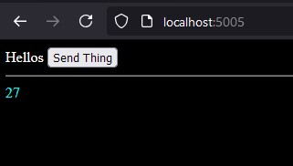

# Authenticator

A fork of AMC-code's Authenticator project, for experimenting

## Behaviour

The server will calculate the sum of a number, and start serving an HTML page, in a definitely-not-convoluted way

Disclaimer: this code is very bad and, really, I just wanted to try to make things work in funny ways
while also hopefully learning about some new technologies. Regardless, here you go:

## Why this fork? Features, fixes, and goals

Features: add Rust🦀, add WebAssembly🧩, add dark theme🌙 

Fixes: use Typescript🇹 instead of JavaScript

Goals: WebAssembly server-side rendering of a chat app with Rust for a 🚀🔥blazingly fast🔥🚀 experience

NON-goals: clean, readable, or organized code; foresight; reason; best practices; practicality

## Screenshot



## Running the server is easy:

Prerequisites: Cargo and Node.js
```
cargo install wasm-pack
npm install -g typescript
```

After cloning this repository, run this command in the `wasm_modules` folder to build the wasm:
```
wasm-pack build --target nodejs
```

Run this command in the main `Authenticator` folder to compile to JS:
```
npx tsc server.ts
```

Run this command to actually run the server on port `5005`:
```
node server.js
```

You should be greeted with a beautifully-crafted server-side-rendered HTML file
